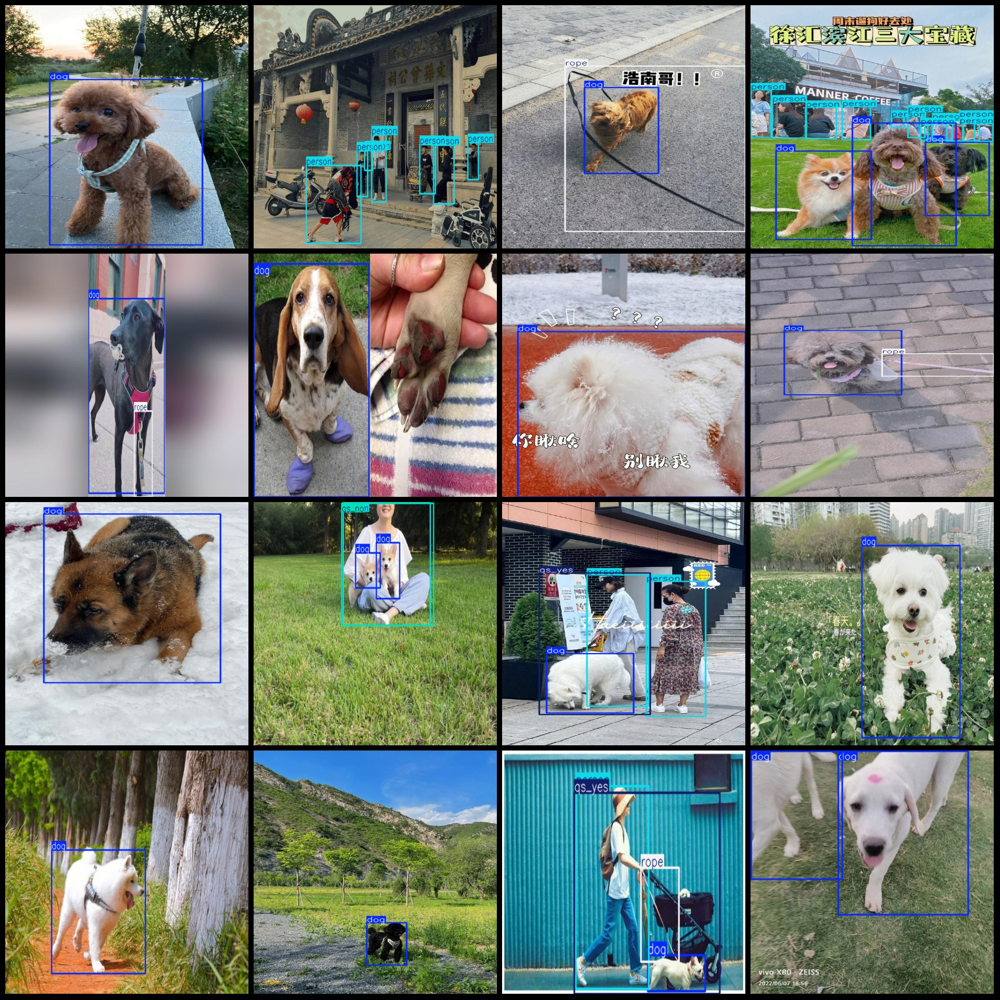
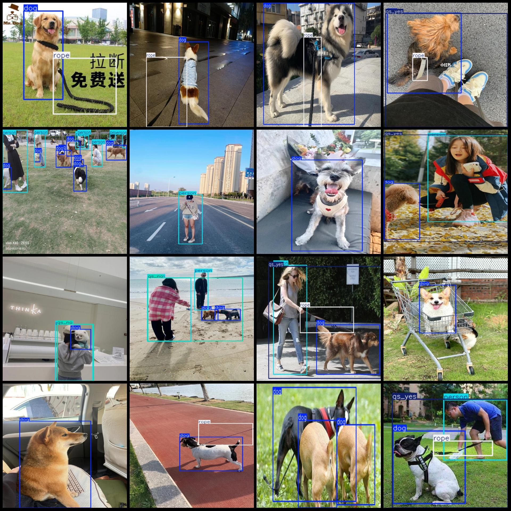

# Wandering Dogs Without a Leash Detection Dataset (VOC+YOLO Format, 1980 Images in 5 Categories)

Dataset format: Pascal VOC format plus YOLO format (txt file without segmentation paths, only including jpg images and corresponding VOC format xml files and YOLO format txt files)
Number of images (jpg file count): 1980
Number of annotations (xml file count): 1980
Number of annotations (txt file count): 1980
Number of annotation categories: 5
Annotation category names (note that the order of categories in the YOLO format does not match this, but is based on the labels folder's classes.txt): ["dog", "person", "qs_no", "qs_yes", "rope"]
Number of bounding boxes for each category:
- dog: 2414
- person: 2078
- qs_no: 208
- qs_yes: 537
- rope: 1028
Total bounding box count: 6265
Image resolution: Multi-resolution images, such as 667x500, 500x500, etc.
Annotation tool used: labelImg
Annotation rule: Draw a rectangular box around the category
Important note: "qs_yes" indicates that a dog is being walked with a leash, only labeled when both humans and dogs are present, and "qs_no" indicates that a dog is not being walked with a leash, only labeled when both humans and dogs are present.
Special statement: This dataset does not guarantee any accuracy or precision of the trained model or weight files, and only provides accurate and reasonable annotations.
Image preview:
Annotation example:

## Image

Here is a pay link on Stripe ( https://buy.stripe.com/3cs8yP7sY87d0vu9AB ). Please contact me lonlonago@foxmail.com after funding $89, and I will send you a complete data files , thank you!

